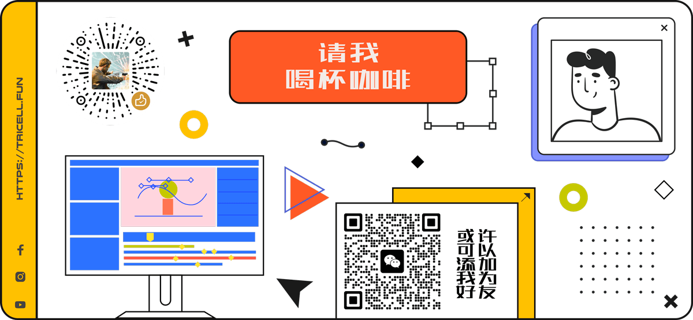

# Three.js 进阶之旅

`Three.js` 进阶之旅，掘金专栏配套项目。从基础入门开始，全方位了解 `Three.js` 的各种特性，并结合和应用对应特性，实现令人眼前一亮的 `Web` 创意页面，进而逐步挖掘 `Three.js` 和 `WebGL` 深层次的知识。

> `🟢` 掘金专栏配套项目：[https://juejin.cn/column/7140122697622618119](https://juejin.cn/column/7140122697622618119)

## 目录介绍

对项目内容有不明白的地方可前往项目对应文章查看。

### 01-introduction

**文章**：[Three.js 进阶之旅：基础入门（上）](https://juejin.cn/post/7145064095178293285)

**摘要**：本文是**Three.js 进阶之旅**系列专栏的首篇文章，本专栏的主要内容具体规划如下：前两篇将简要介绍 `Three.js` 开发环境搭建以及Three.js 的一些基础概念和必备知识，后续文章会通过一个个趣味的 `3D` 页面实例，逐步讲解 `Three.js` 相关性能优化、着色器、后期渲染、物理特性等应用中知识……

### 02-basic

**文章**：[Three.js 进阶之旅：基础入门（下）](https://juejin.cn/post/7146383940931026958)

**摘要**：本篇文章将继续通过一个简单 `3D` 创意页面的开发，简要汇总一下必备的 `Three.js` 的基础知识，梳理要点，为后续页面的开发打下坚实的基础。通过本文的内容，你将获得的知识包括：`OrbitControls` 镜头轨道控制器的使用、`Scene.Fog` 场景雾化、`Three.js` 中的光源、几何体、材质、模型、贴图、动画等。

### 03-shadow

**文章**：[Three.js 进阶之旅：模型光源结合生成明暗变化的创意页面-光与影之诗](https://juejin.cn/post/7148969678642102286)

**摘要**：本文使用 `Three.js` 基础知识以及 `Tween` 补间动画相关的知识，创建一个使用光源和模型结合而成的 `3D` 创意页面。你将学到使用 `Blender` 压缩模型、使用模型加载管理器管理加载进度、使用模型加载器加载压缩过的模型、优化渲染器的输出效果、使用 `TWEEN` 实现位移动画和镜头补间动画、点光源随鼠标移动动画、鼠标光标悬浮到导航栏时虚拟光标动画、监听页面元素可见性以及 `CSS` 动画效果等。

### 04-particles

**文章**：[Three.js 进阶之旅：神奇的粒子系统-迷失太空](https://juejin.cn/post/7155278132806123557)

**摘要**：本文将讨论关于 `Three.js` 中各种创建粒子的方式和以及如何优化粒子的样式和使用粒子，最终将结合本文所讲的粒子知识，制作一个充满趣味和创意的 `3D` 粒子页面——**迷失太空**。

### 05-shader

**文章**：[Three.js 进阶之旅：Shader着色器入门](https://juejin.cn/post/7158032481302609950)

**摘要**：本文内容主要介绍 `Three.js` 中的着色器知识，通过讲解什么是着色器、着色器的分类、`GLSL` 语言的核心语法要点、`Three.js` 中的两种着色器材质的 `RawShaderMaterial` 和 `ShaderMaterial` 的区别和用法等基本知识，深入理解着色器，并使用它创建出有趣的三维图形。

### 06-shader-pattern

**文章**：[Three.js 进阶之旅：Shader着色器基础图案-旷野之息神庙铁球](https://juejin.cn/post/7158628520623603748)

**摘要**：本文内容主要是 `Three.js` 着色器的实践和应用，将在上篇文章的基础上通过 `50个` 着色器简易图案例子，一步步理解使用着色器创建图案的步骤和技巧。最后，将使用绘制的着色器图案，构建一个类似于《**塞尔达传说：旷野之息**》游戏中的**神庙铁球**效果。

### 07-postprocessing

**文章**：[Three.js 进阶之旅：后期处理-3D瑞克与莫蒂](https://juejin.cn/post/7166785669866455070)

**摘要**：本文内容就接着上文内容详细讲解一下 `Three.js` 后期处理的基本知识。最后，通过结合文章讲解的知识内容，将开发一个《**瑞克与莫蒂**》发光传送门效果的 `3D` 页面。

### 08-media

**文章**：[Three.js 进阶之旅：多媒体应用-3D Iphone](https://juejin.cn/post/7171244215270113310)

**摘要**：文章将依次详细讲解 `Three.js` 中文本字体、图片、音频、视频等多媒体元素的原理。了解完基本原理后，将利用本文内容所学到的知识，简单制作一个可以播放视频的三维手机展示页面……

### 09-scroll-animation

开发中……

### 10-rabbit-craft-go

**文章**：[Three.js 进阶之旅：新春特典-Rabbit craft go](https://juejin.cn/post/7191415427350659129)

**摘要**：本文内容作为兔年新春纪念页面，将使用 `Three.js` 及其他前端开发知识，创建一个以兔子为主题的 `3D` 简单的趣味页面 `Rabbit craft go`。包括使用纯代码创建三维浮岛、小河、树木、兔子、胡萝卜以及兔子的运动交互、浮岛的动画效果……

### 11-physics

**文章**：[Three.js 进阶之旅：物理效果-碰撞和声音](https://juejin.cn/post/7200039970575941693)

**摘要**：本文内容主要汇总如何在 `Three.js` 创建的 `3D` 世界中添加物理效果，使其更加真实。你将学习到如何使用 `Cannon.js` 创建一个 `3D` 物理世界，并在物理世界更新对象、联系材质、施加外力、处理多个物体中添加物体之间的碰撞效果，通过检测碰撞激烈程度来添加撞击声音等。

### 12-physics

**文章**：[Three.js 进阶之旅：物理效果-3D乒乓球小游戏](https://juejin.cn/post/7212268146580947005)

**摘要**：本文将使用新的技术栈 `React Three Fiber` 和 `Cannon.js` 来实现一个具有物理特性的小游戏，通过本文的阅读，你将学习到 `React Three Fiber` 及它的相关生态、使用 `React Three Fiber` 搭建基础三维场景、如何使用新技术栈给场景中对象的添加物理特性等，最后将开发一个简单的乒乓球小游戏。

### 13-panorama

**文章**：[Three.js 进阶之旅：全景漫游-初阶移动相机版](https://juejin.cn/post/7215268204062490679)

**摘要**：`3D` 全景技术可以实现日常生活中的很多功能需求，比如地图的街景全景模式、数字展厅、在线看房、社交媒体的全景图预览、短视频直播平台的全景直播等。本文内容及此专栏下一篇文章将实现如何在多个3D全景中穿梭漫游，达到如在真实世界中前进后退的视觉效果。

### 14-panorama-advanced

开发中……

> `👨‍💻` 持续更新中 ···

